# Prescription Image Processing with Gemini 1.5 Flash

## Overview

This plan outlines the implementation of prescription image processing for SaarthiRx, enabling users to upload or capture prescription images and receive structured, elder-friendly medicine information using Google's Gemini 1.5 Flash API.

---

## User Review Required

> [!IMPORTANT]
> **API Key Storage**: This plan uses a frontend-only approach with the Gemini API key stored in `.env`. For production, consider implementing a backend proxy to protect the API key. Is this acceptable for the current phase?

> [!IMPORTANT]
> **Gemini API Key**: You'll need to obtain a Gemini API key from [Google AI Studio](https://aistudio.google.com/app/apikey) and add it to your `.env` file as `VITE_GEMINI_API_KEY`.

---

## Architecture Overview

```mermaid
flowchart LR
    A[📷 User Captures/Uploads Image] --> B[Image Processing Service]
    B --> C[Gemini 1.5 Flash API]
    C --> D[Structured Medicine Data]
    D --> E[PrescriptionView Display]
    E --> F[🔊 Voice Announcement]
```



**Key Design Decisions**:
- **Frontend-only integration**: Direct Gemini API calls from the browser (simpler deployment, API key in env)
- **Gemini 1.5 Flash**: Optimized for speed and cost-efficiency for prescription OCR
- **Structured JSON output**: Request JSON schema from Gemini for reliable parsing
- **Multi-language support**: Generate instructions in user's preferred language (en-US, hi-IN, mr-IN)

---

## 🔒 Privacy Safeguards (Image Handling)

> [!CAUTION]
> **Prescription images contain sensitive medical data.** The following safeguards ensure images are NEVER stored or persisted.

### Implementation Details

| Safeguard | Implementation | File |
|-----------|----------------|------|
| **Memory-only processing** | Images held in JavaScript variables only, never written to disk | `ScanPrescription.jsx` |
| **Immediate cleanup after API** | `clearImageData()` called immediately after Gemini response | `imageUtils.js` |
| **No localStorage** | Prescription state uses React `useState` only, not localStorage | `AppContext.jsx` |
| **No Firebase storage** | Images never uploaded to Firebase Storage or Firestore | N/A |
| **Object URL revocation** | `URL.revokeObjectURL()` called on component unmount | `ScanPrescription.jsx` |
| **Page refresh = data gone** | All image and prescription data lost on page refresh (by design) | All |

### Data Flow with Privacy Checkpoints

```mermaid
flowchart TD
    A[📷 User selects image] --> B[File held in memory only]
    B --> C[compressImage - creates temp canvas]
    C --> D[Canvas converted to base64]
    D --> E[🔒 Original file reference released]
    E --> F[API call to Gemini]
    F --> G[🔒 clearImageData called]
    G --> H[base64 set to null]
    H --> I[Only text data remains]
    I --> J[React state - not persisted]
    
    style E fill:#22c55e,color:white
    style G fill:#22c55e,color:white
    style H fill:#22c55e,color:white
```



### Code Implementation

**Cleanup on component unmount:**
```javascript
useEffect(() => {
  return () => {
    if (previewUrl) revokePreviewUrl(previewUrl);
    if (imageDataRef.current) {
      clearImageData(imageDataRef.current);
      imageDataRef.current = null;
    }
  };
}, [previewUrl]);
```

**Immediate cleanup after processing:**
```javascript
const result = await processPrescription(imageData.base64, ...);
// PRIVACY: Clear immediately after API response
clearImageData(imageDataRef.current);
imageDataRef.current = null;
```

### Gemini API Data Policy

Per [Google's Gemini API Terms](https://ai.google.dev/terms):
- API requests are processed but not stored for model training
- Data is transmitted over HTTPS
- No persistent storage of uploaded images on Google's servers for API calls

## Proposed Changes

### Component: Configuration

#### [MODIFY] [.env](file:///c:/Users/Salonee/OneDrive/Desktop/project/saarthirx/.env)

Add Gemini API key configuration:

```diff
 VITE_FIREBASE_API_KEY="..."
 VITE_FIREBASE_AUTH_DOMAIN="..."
 VITE_FIREBASE_PROJECT_ID="..."
 VITE_FIREBASE_STORAGE_BUCKET="..."
 VITE_FIREBASE_MESSAGING_SENDER_ID="..."
 VITE_FIREBASE_APP_ID="..."
 VITE_RECAPTCHA_SITE_KEY="..."
+VITE_GEMINI_API_KEY="your-gemini-api-key-here"
```

---

### Component: Gemini Service Layer

#### [NEW] [geminiService.js](file:///c:/Users/Salonee/OneDrive/Desktop/project/saarthirx/src/services/geminiService.js)

Core service for Gemini API integration:

| Function | Purpose |
|----------|---------|
| `initializeGemini()` | Initialize Gemini client with API key |
| `extractPrescriptionData(imageBase64)` | Send image to Gemini, get structured medicine data |
| `generateMedicineInstructions(medicineData, language)` | Generate elder-friendly instructions in user's language |

**Gemini Prompt Strategy**:
```
Analyze this prescription image and extract medicine information.
Return JSON with this structure:
{
  "medicines": [
    {
      "name": "Medicine Name",
      "dosage": "5mg",
      "frequency": "twice daily",
      "timing": ["morning", "evening"],
      "withFood": true,
      "duration": "7 days",
      "visualDescription": "Small round white tablet"
    }
  ],
  "doctorName": "Dr. Name (if visible)",
  "date": "Prescription date (if visible)"
}
```

---

### Component: Image Utilities

#### [NEW] [imageUtils.js](file:///c:/Users/Salonee/OneDrive/Desktop/project/saarthirx/src/utils/imageUtils.js)

Utilities for image handling:

| Function | Purpose |
|----------|---------|
| `fileToBase64(file)` | Convert File object to base64 string |
| `compressImage(file, maxWidth)` | Compress image to reduce API payload size |
| `getMimeType(file)` | Extract MIME type for Gemini API |

---

### Component: Prescription Scan Page

#### [NEW] [ScanPrescription.jsx](file:///c:/Users/Salonee/OneDrive/Desktop/project/saarthirx/src/pages/ScanPrescription.jsx)

Elder-friendly prescription capture page:

**UI Elements**:
- Large camera capture button with 📷 icon
- Large upload/gallery button with 🖼️ icon
- Preview of captured/selected image
- Processing indicator with voice feedback
- Error display with retry option

**Elder-Friendly Features**:
- Minimum 80px touch targets
- Clear visual feedback during processing
- Voice announcements at each step
- Simple two-option interface (Camera vs Gallery)

**Flow**:


---

### Component: Prescription Results

#### [MODIFY] [PrescriptionView.jsx](file:///c:/Users/Salonee/OneDrive/Desktop/project/saarthirx/src/pages/PrescriptionView.jsx)

Update to receive real prescription data:

**Changes**:
- Accept medicine data from navigation state or context
- Replace hardcoded sample data with dynamic data
- Handle multiple medicines from single prescription
- Add loading state for instruction generation

---

### Component: Medicine Storage Context

#### [MODIFY] [AppContext.jsx](file:///c:/Users/Salonee/OneDrive/Desktop/project/saarthirx/src/context/AppContext.jsx)

Add prescription state management:

```diff
+ // Scanned prescriptions state
+ const [prescriptions, setPrescriptions] = useState([]);
+ const [currentPrescription, setCurrentPrescription] = useState(null);
+ 
+ // Add prescription to history
+ const addPrescription = (prescriptionData) => {
+   const newPrescription = { id: Date.now(), ...prescriptionData };
+   setPrescriptions(prev => [newPrescription, ...prev]);
+   setCurrentPrescription(newPrescription);
+ };
```

---

### Component: Routing Updates

#### [MODIFY] [App.jsx](file:///c:/Users/Salonee/OneDrive/Desktop/project/saarthirx/src/App.jsx)

Add route for scan page:

```diff
+ import ScanPrescription from './pages/ScanPrescription';

  <Routes>
    ...
+   <Route path="/scan" element={<ScanPrescription />} />
    <Route path="/prescription/:id" element={<PrescriptionView />} />
  </Routes>
```

---

## File Summary

| File | Action | Purpose |
|------|--------|---------|
| `.env` | Modify | Add Gemini API key |
| `geminiService.js` | New | Gemini API integration |
| `imageUtils.js` | New | Image processing utilities |
| `ScanPrescription.jsx` | New | Image capture/upload page |
| `PrescriptionView.jsx` | Modify | Dynamic prescription display |
| `AppContext.jsx` | Modify | Prescription state management |
| `App.jsx` | Modify | Add scan route |

---

## Verification Plan

### Automated Tests

1. **Image Processing Test**
   - Upload sample prescription image
   - Verify Gemini returns valid JSON structure
   - Verify all required fields are populated

2. **UI Interaction Test**
   - Navigate to `/scan` route
   - Verify camera and gallery buttons are visible
   - Test image preview functionality

### Manual Verification

1. **End-to-End Flow**
   - Capture/upload a real prescription image
   - Verify medicine extraction accuracy
   - Verify voice announcement in selected language

2. **Elder-Friendly UI Check**
   - Verify button sizes meet 80px minimum
   - Test on mobile device for haptic feedback
   - Verify text is clearly readable

3. **Multi-Language Test**
   - Test with each language (English, Hindi, Marathi)
   - Verify instructions are generated in correct language

---

## Dependencies to Install

```bash
npm install @google/generative-ai
```

This is the official Google Generative AI SDK for JavaScript that provides a clean interface for Gemini API calls.

---

## API Key Setup

1. Go to [Google AI Studio](https://aistudio.google.com/app/apikey)
2. Create a new API key
3. Add to `.env`:
   ```
   VITE_GEMINI_API_KEY="your-api-key-here"
   ```

---

## Next Steps After Approval

1. Install Gemini SDK dependency
2. Create `geminiService.js` with API integration
3. Create `imageUtils.js` for image handling
4. Create `ScanPrescription.jsx` page
5. Update `AppContext.jsx` with prescription state
6. Update `App.jsx` with new route
7. Update `PrescriptionView.jsx` for dynamic data
8. Test end-to-end flow
